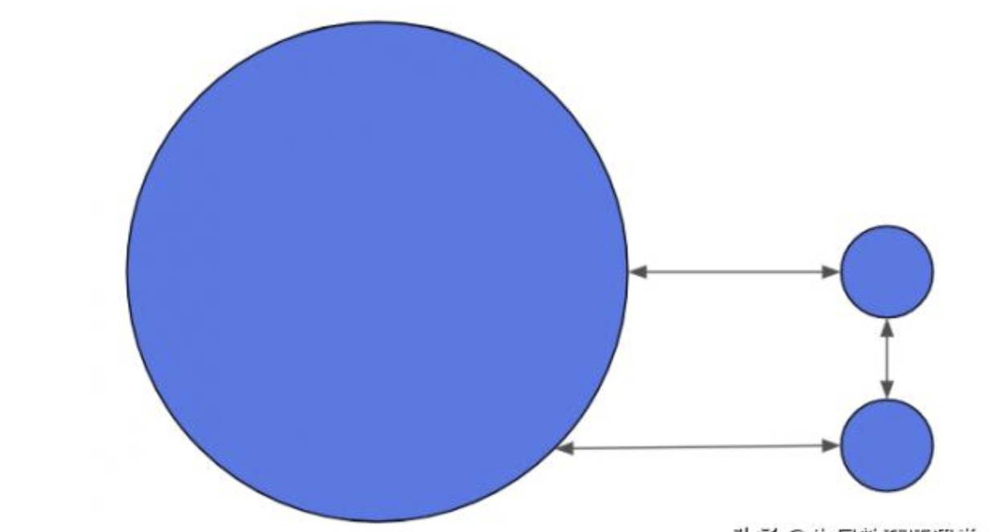
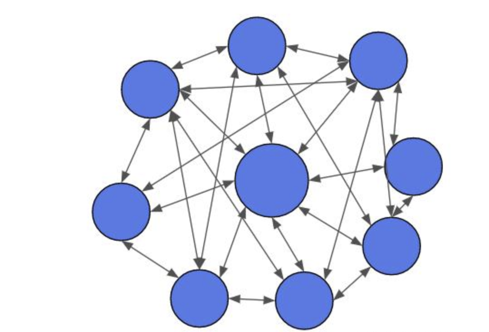
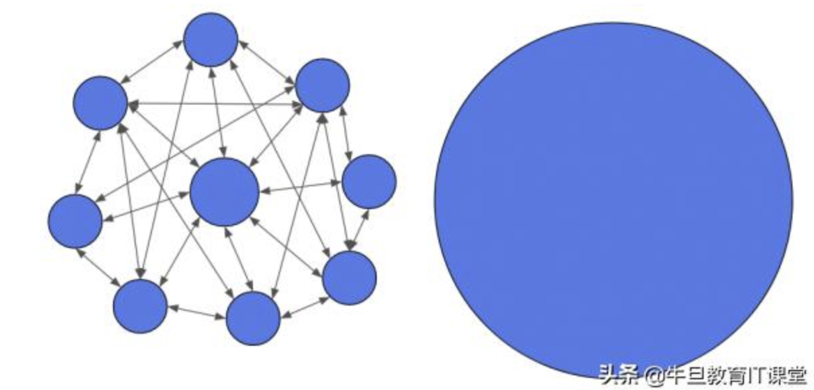
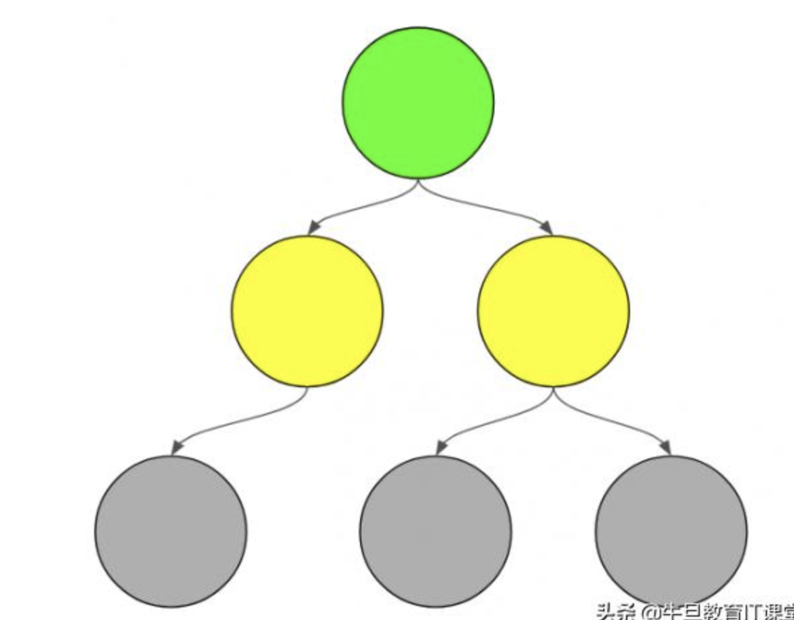

# 做不做微服务

### 那些没说出口的研发之痛， 做与不做微服务的几大理由

创建一种新的软件项目架构，来封装离散服务，对于全新的项目来说，这是非常简单的。但是，对于大多数软件开发者来说，谁又有大把的奢侈时间一直用在全新项目上呢？

大多数软件开发人员职责更多是维护或增加现有软件系统的功能。但是，如果问开发人员究竟是愿意构建全新的项目，还是维护一个现有的系统，那么支持新项目的呼声肯定会成为压倒性的声音。事实上，希望与新技术或新项目合作也是开发人员离职的原因之一。为什么呢？

## 识别问题容易，但修复很难
### 维护现有系统时，很容易识别架构的问题。为什么？
因为基于良好的架构，系统很容易调整。而当需要去调整一个没有设计封装波动的已有系统时，架构的弱点就不言自明。即使是最小的表层变化也会给整个系统的其他部分带来复杂的涟漪：新的依赖看似要无止境地延续下去，通过臃肿的方法签名获得更多的参数，自动化测试的规模和复杂性爆炸，同时降低了实际效用。

### 这些问题是不是听起来很熟悉？你企业的架构是这样的吗？

如果答案是肯定的，那么你有一个单体架构。单体架构是大多数软件开发者遇到的最常见架构。

这个单体架构来自那些根本没有设计封装波动的系统，但是随着业务需求和时间的推移，变得越来越复杂。

### 那么用单体架构做什么呢？

每个人在单体架构中工作时都会感到痛苦，开发和业务人员也是如此。开发者讨厌臃肿的单体架构，因为开发的难度会随着新开发动作的增加而增加。一旦单体架构达到临界值，如何改变会成为一个真正可怕的命题。这会导致生产力和团队士气下降，业务受到影响。企业需要快速行动，单体架构却会随着时间的推移而变得越来越慢。

许多开发人员都希望把已有的架构丢掉，重新开始，但是这种想法无法和业务一起成长。“最好的软件是目前就让企业赚钱的软件，无论设想中的新版本多么伟大！”

所以新的计划不能完全抛弃旧有的单体架构，业务要继续，但不会再增加单体架构的复杂度。

### 微服务？

微服务是一个流行的词汇，它模糊地表达了一个面向服务的架构，其中包含许多小的离散服务。

从表面上看，微服务似乎是单体架构的对立面（每个人都讨厌单体架构），许多微服务通过提出新的特性请求，并以独立服务的形式出现。**这里的问题是：当单体架构封装所有系统的波动性，解耦的独立服务并不能使企业免于任何波动。**

以下是用微服务实现单个功能架构，它大概像这个样子：

### 单体应用变得小了一点，新功能清晰地从系统的其余部分解耦。这很好吗？

### 当下一个功能请求进入时会发生什么？

有两个功能，我们已经看到一个问题。第二个功能建立在第一个功能之上，所以不能完全隔离。

如果随着功能请求的进入，简单地创建新的微服务，而不是封装整个波动区域：

### 有改善吗？来看看原始单体应用旁边的微服务：

如果仔细观察，会发现，所有服务依赖线模糊在一起，这只是发明了一个更复杂的单体架构。

小小的改变在整个系统中仍然会带来复杂的涟漪。整个系统的行为改变将涉及到改变多个微服务。所有相同的问题再次出现，甚至可能更糟糕，这加剧了依赖关系难以追踪的事实，而且，精心策划的多服务部署比庞大的单体应用更加可怕。

### 什么地方出了错？

问题源于微服务本身不是架构。微服务就是一个简单的词，描述了作为独立服务运行的系统，而不是一个单体应用。软件架构的实际实践包括仔细规划，在哪里划分离散服务之间的界限，从而包含波动区域。当简单地拿出一个单体应用，作为独立服务来实施时，就没有必要来考虑整个系统的封装波动。

**把系统看作一个整体，才能谈架构**

### 因此，如果单体应用，功能驱动的微服务太小，该怎么做应对？

要知道想去的方向

要像从头开始创建一样，为整个系统设计理想的架构。

企业不能一下子从一个单体架构直接进入微服务架构，但是如果第一次启动的时候，不清楚想达成的方向，那么永远也不会到达那里。

给所有希望拆分现有单体应用的软件开发者提供一些建议，但实际情况是这个路线图对于每个系统都是独一无二的。

### Tips
> 如果只是设计新的功能而忽略已有的单体应用，则无法创建出色的架构；

> 如果不考虑整个系统，单体应用就不能有效分解；

> 微服务只是一个流行词。更小并不总是更好。精心拆分服务边界很重要；

## 微服务与团队：康威定律
微服务架构是独特的，随着时间的推移仍然保持灵活性，在一个项目的组织架构中时时发生影响 。对于大多公司而言，这非常具有挑战性，因为它要求企业重新考虑组织模式。当准备开始微服务架构时，可以先问自己：“企业的组织能力是什么？“在早期，先决条件应该是预先准备会遇到的困难，并思考应对之策。

### 微服务与康威定律：企业需要与团队协同的架构

当涉及到组织团队和微服务，著名的康威定律经常被提到。这项定律，越来越被广泛地接受。

这一定律的缺陷在于，它更多是一种社会学规律，而不是纯粹的科学规律，事实上，它总是以实证、实例的方式，而不是纯粹的科学逻辑来论证。一般来说，社会学的结果很难证明，因为这些论证很大程度上基于假想中的思考和概念，只能通过更多的实例来加以验证。

“组织的系统设计…往往受限于组织架构的产品设计和通信的副本。”从这个规律，可以得出一些简单的结论：

### 如果想要特定的结构，需要一个与组织团队协同的架构。

### 如果经常改变架构，组织团队也需要经常修改。

这两个断言，对于康威定律的原则，有着深远的影响。首先是一个企业的适应能力，避免了野心家的倾向，对变革的抵制等等，也引发了机器取代人力的哲学思考。

基于以上结论，要上微服务架构的第一个问题是：“组织团队如何适应这种架构?” Netflix 和亚马逊的情况，当然是很正向的，但是否你的企业是否准备好了？其中重要的是，挖掘技巧和发现问题时的“刹车”措施来规避风险。

其中的技巧能迅速提升团队的能力。在创建一个功能时，负责功能实现的团队汇集了很多不同的技巧。当架构进入微服务模式时，将出现更多的协调性需求。

另一个窍门是开源技术的治理模式。开源项目由于其分散的结构，使它能够创建高度松耦合的软件，这是微服务架构的优点之一。它因此成为与其他团队的协作方式，并推动具有代码能力的小团队，在代码中实现变化。

但是，这个逻辑和组织变革在公司的接受度如何？这些技巧是否足够在全公司范围内协调、积累经验和知识？分散的组织构建松耦合的代码，但技术或功能性的知识和技能不可能极端的解耦。否则，这就像拆东墙补西墙，是在用拆掉的墙来构建松耦合的架构。

真正的僵局会出现在文化和管理风格上，这点在最近几年有了好转。

一个比较好的例子是Spotify的框架（虽然我们应该限制自己使用meta frameworks，原因不再赘述）。Spotify采用通过使用开源组件来架构功能和治理，使用这些工具在一定规模下实现了灵活性矩阵模型。矩阵式组织必须确保知晓不同人具备的知识或技能。

最近流行的新管理方法已初见影响，特别是在那些寻求实现微服务的团队组织中。

### Holacracy管理模式：满足业务模式前提下，完成微服务最佳实践

上面谈到了企业文化、主体、和变革的阻力。第一种类型的管理，来源于 Holacracy 管理模式。

Holacracy分为自治和独立，并链接比自己更高的实体。这些圈子以闭环的形式，可以互相重叠，具有自组织而被上层管理的特殊性。每个圈子对于性质和组成的变化非常敏感。

可以想象，例如，底层圈子是微服务的开发队伍，而上一层是架构和产品负责人，最顶端是应用的客户业务线。这将让产品和架构负责人要能在满足业务需求的前提下，才能保证架构的最佳实践。

这种架构方式也是开发者、软件架构师的典型方式。所有可能来自不同或重叠的圈子组织。建立这种类型的组织是为了提高知识传输和构建架构的时间效率。

我们可能会认为，这种管理比较符合传统的层级组织。事实上，即使层次是扁平的，它仍然存在，可以限制其项目团队。总之，最好的方式就是简化人与人之间的链接。
